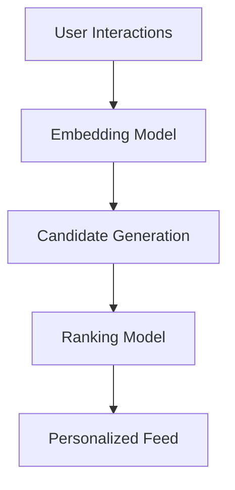

## Overview

ByteDance powers platforms like TikTok and Douyin, bringing content to billions. You interact with personalized feeds driven by core concepts: sophisticated recommendation algorithms, dynamic user engagement models, and seamless cross-platform accessibility. These principles ensure content reaches users regardless of language or location.

<Columns cols={3}>
  <Card title="Recommendation Algorithms" icon="zap" href="#content-recommendation-algorithms">
    Machine learning models analyze your behavior to surface relevant videos in seconds.
  </Card>
  <Card title="User Engagement Models" icon="users" href="#user-engagement-models">
    Metrics and strategies keep you watching, liking, and sharing across apps.
  </Card>
  <Card title="Cross-Platform Accessibility" icon="globe" href="#cross-platform-accessibility">
    Unified experiences work on mobile, web, and beyond cultural boundaries.
  </Card>
</Columns>

## Content Recommendation Algorithms

ByteDance's algorithms process vast data to recommend content. They use collaborative filtering and deep learning to match videos to your interests.

<Callout kind="info">
  Algorithms refresh feeds every `<60s` for real-time personalization.
</Callout>

Follow these steps to understand a typical recommendation flow:

<Steps>
  <Step title="Collect User Data" icon="database">
    Gather watch history, likes, and device signals.
  </Step>
  <Step title="Compute Embeddings" icon="cpu">
    Transform data into vector representations using neural networks.
  </Step>
  <Step title="Rank Candidates" icon="trending-up">
    Score millions of videos against your profile.
  </Step>
  <Step title="Serve Feed" icon="play">
    Deliver top `<100` items to your app.
  </Step>
</Steps>



<CodeGroup tabs="Python,JavaScript">
  ```python
  import numpy as np
  from sklearn.metrics.pairwise import cosine_similarity

  # Simulate user-video embeddings
  user_emb = np.array([0.1, 0.8, 0.3])
  video_embs = np.array([[0.2, 0.7, 0.4], [0.9, 0.2, 0.1]])

  similarities = cosine_similarity([user_emb], video_embs)
  top_video = np.argmax(similarities)
  print(f"Recommended video index: {top_video}")
  ```
  ```javascript
  // Simulate recommendation scoring
  const userEmbedding = [0.1, 0.8, 0.3];
  const videoEmbeddings = [[0.2, 0.7, 0.4], [0.9, 0.2, 0.1]];

  const similarities = videoEmbeddings.map(video =>
    userEmbedding.reduce((sum, val, i) => sum + val * video[i], 0)
  );
  const topVideo = similarities.indexOf(Math.max(...similarities));
  console.log(`Recommended video index: ${topVideo}`);
  ```
</CodeGroup>

## User Engagement Models

Engagement models track metrics like watch time and shares. You see tailored content that boosts retention.

<Tabs>
  <Tab title="Watch Time" icon="clock">
    Prioritizes videos you watch >`{75%}` of duration.

    | Metric       | Threshold     | Impact                  |
    |--------------|---------------|-------------------------|
    | Avg Watch Time | >15s        | Boosts ranking by 2x   |
    | Completion Rate | >75%       | Enters viral pool      |
  </Tab>
  <Tab title="Social Interactions" icon="share-2">
    Likes and shares amplify reach across networks.
  </Tab>
</Tabs>

## Cross-Platform Accessibility

Access ByteDance content on any device. APIs and SDKs ensure consistency.

<Expandable title="Advanced Accessibility Features" default-open="false">
  Features include auto-translation for 100+ languages and adaptive streaming for varying bandwidths. Use the TikTok API for integration:

  <ParamField path="user_id" param-type="string" required="true">
    Your unique user identifier.
  </ParamField>

  <ParamField query="locale" param-type="string" required="false">
    Set to `en-US` or `zh-CN` for localization.
  </ParamField>
</Expandable>

<Callout kind="tip">
  Test cross-platform with emulators for iOS, Android, and web.
</Callout>

These concepts interconnect: recommendations drive engagement, which enhances accessibility globally. Integrate them into your apps for optimal user experiences.