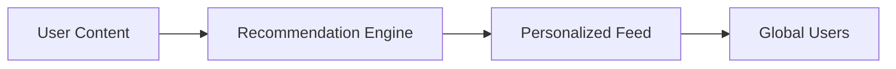

## Overview

ByteDance builds innovative technology to bring people closer together through content discovery and creation. You encounter ByteDance products daily, powering billions of personalized experiences. This documentation guides you through integrating with ByteDance platforms, accessing APIs, and leveraging developer tools.

<Callout kind="info">
  ByteDance prioritizes user privacy and content moderation across all platforms.
</Callout>

## Mission and Vision

ByteDance's mission inspires creativity and joy by surfacing high-quality content tailored to individual interests. The company envisions a world where everyone discovers inspiring ideas, regardless of borders. You benefit from algorithms that recommend videos, articles, and more based on real-time user behavior.

## Key Platforms

Explore ByteDance's flagship platforms designed for global audiences.

<Columns cols={2}>
  <Card title="TikTok" icon="music" href="/docs/platforms/tiktok">
    Short-form video app with 1.5+ billion users. Create, share, and discover viral content.
  </Card>
  <Card title="Douyin" icon="smartphone" href="/docs/platforms/douyin">
    China-exclusive version of TikTok, focusing on e-commerce and live streaming.
  </Card>
</Columns>

<Tabs>
  <Tab title="TikTok" icon="global">
    TikTok reaches 150+ countries. You integrate via the TikTok API for video uploads and analytics.

    ```javascript
    const response = await fetch('https://open.tiktokapis.com/v2/video/query/', {
      method: 'POST',
      headers: {
        'Authorization': `Bearer ${accessToken}`,
        'Content-Type': 'application/json'
      },
      body: JSON.stringify({
        'video_ids': ['1234567890']
      })
    });
    ```
  </Tab>
  <Tab title="Douyin" icon="shopping-bag">
    Douyin drives commerce with 600M+ daily users. Use the Douyin Open Platform for shop integrations.

    ```python
    import requests

    headers = {
        'Authorization': f'Bearer {access_token}',
        'Content-Type': 'application/json'
    }
    data = {'shop_ids': ['987654321']}
    response = requests.post('https://open.douyin.com/shop/query/', headers=headers, json=data)
    ```
  </Tab>
</Tabs>

## Global Reach and Impact

ByteDance operates in 150+ countries, serving over 2 billion users monthly. The platforms generate 1 billion videos daily, fostering cultural exchange.

| Metric          | TikTok      | Douyin     |
|-----------------|-------------|------------|
| Monthly Users   | 1.5B+      | 700M+     |
| Daily Videos    | 1B+        | 300M+     |
| Markets         | 150+       | China     |

<Steps>
  <Step title="Sign Up" icon="user-plus">
    Create a developer account at developers.bytedance.com.
  </Step>
  <Step title="Get API Key" icon="key">
    Generate your `{API_KEY}` from the console dashboard.
  </Step>
  <Step title="Integrate" icon="code">
    Follow platform-specific guides to embed content.
  </Step>
  <Step title="Go Live" icon="rocket">
    Deploy and monitor analytics for optimization.
  </Step>
</Steps>

<Expandable title="Advanced Impact Metrics" default-open="false">

ByteDance's recommendation engine processes petabytes of data daily, achieving `<90%` user retention through precise personalization. You access these insights via enterprise APIs.



</Expandable>

<CodeGroup tabs="JavaScript,Python">
```javascript
// Fetch trending videos
const trends = await fetch('https://open.tiktokapis.com/v2/research/video/query/', {
  headers: { 'Authorization': `Bearer ${token}` }
});
```
```python
# Query trends
response = requests.get('https://open.douyin.com/research/video/query/',
                       headers={'Authorization': f'Bearer {token}'})
```
</CodeGroup>