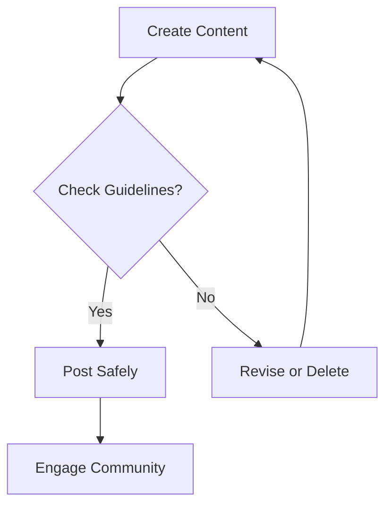

## Overview

ByteDance platforms like TikTok and CapCut empower you to create, discover, and share content globally. You access personalized feeds, build communities, and follow safety guidelines to ensure positive experiences. This guide covers key features step by step.

<Columns cols={3}>
  <Card title="Create Content" icon="video" href="#">
    Record and edit videos with intuitive tools.
  </Card>
  <Card title="Discover Feed" icon="search" href="#">
    Tailor your experience with algorithms.
  </Card>
  <Card title="Stay Safe" icon="shield" href="#">
    Report issues and follow rules.
  </Card>
</Columns>

## Creating and Sharing Content

Follow these steps to produce and distribute engaging videos on TikTok.

<Steps>
  <Step title="Record Video" icon="camera">
    Open the TikTok app and tap the `+` button. Hold the record icon to capture footage up to 10 minutes. Add effects from the right panel.
  </Step>
  <Step title="Edit with CapCut" icon="scissors">
    Export to CapCut for advanced edits. Trim clips, add transitions, and overlay text.

    ```javascript
    // Example: Embed edited video preview
    const videoUrl = 'https://www.tiktok.com/@user/video/123456789';
    console.log(`Share this: ${videoUrl}`);
    ```
  </Step>
  <Step title="Add Captions and Hashtags" icon="tag">
    Write a catchy caption with relevant hashtags like `#ByteDanceTips`. Select privacy settings.
  </Step>
  <Step title="Share" icon="share-2">
    Post to your feed, duet, or stitch with others. Track views via analytics.
  </Step>
</Steps>

<Callout kind="tip">
  Use trending sounds to boost visibility. Aim for videos `<60s` for higher engagement.
</Callout>

## Personalization and Discovery Features

Customize your experience across platforms.

<Tabs>
  <Tab title="TikTok" icon="music">
    Go to Profile > Settings > Privacy. Enable `Recommended for You` and follow interests.

    <Expandable title="Advanced Filters" default-open="false">
      Block keywords and mute accounts to refine your For You Page (FYP).
    </Expandable>
  </Tab>
  <Tab title="CapCut" icon="edit-3">
    In projects, save templates. Sync with TikTok account for seamless export.

    ```python
    # Simulate personalization API call (for reference)
    import requests
    response = requests.get('https://api.bytedance.com/personalize', params={'user_id': 'your_id'})
    print(response.json()['recommendations'])
    ```
  </Tab>
  <Tab title="Douyin (China)" icon="globe">
    Adjust language and region in settings. Discover local trends via Explore tab.
  </Tab>
</Tabs>

<CodeGroup tabs="JavaScript,Python">
  ```javascript
  // Share TikTok video embed
  const embed = document.createElement('iframe');
  embed.src = 'https://www.tiktok.com/embed/v2/123456789';
  document.body.appendChild(embed);
  ```
  ```python
  # Generate shareable link
  video_id = '123456789'
  share_url = f'https://www.tiktok.com/@creator/video/{video_id}'
  print(share_url)
  ```
</CodeGroup>

## Safety and Community Guidelines

Prioritize respectful interactions.

- Review [Community Guidelines](https://www.bytedance.com/guidelines) before posting.
- Report violations via the three-dot menu on any content.
- Enable Family Pairing for parental controls.

<Callout kind="alert">
  Avoid hate speech, misinformation, or harassment. Violations lead to account suspension.
</Callout>

| Guideline | Action | Example |
|-----------|--------|---------|
| No Spam | Report repetitive posts | Bulk follows or identical comments |
| Respect Privacy | Block/tag management | Unauthorized duets |
| Age-Appropriate | Content filters | 13+ restrictions |



Build thriving communities by following these practices daily. Explore more features in-app for continuous improvement.